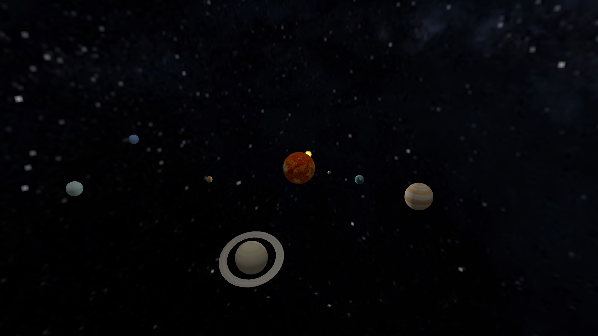
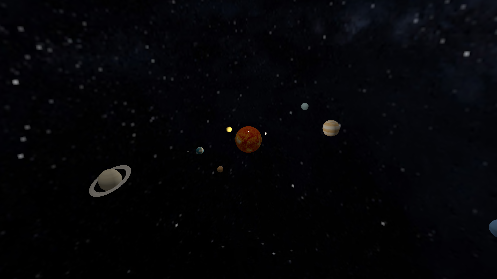
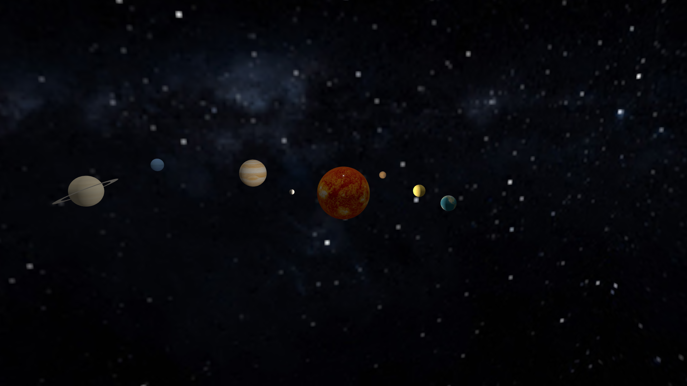
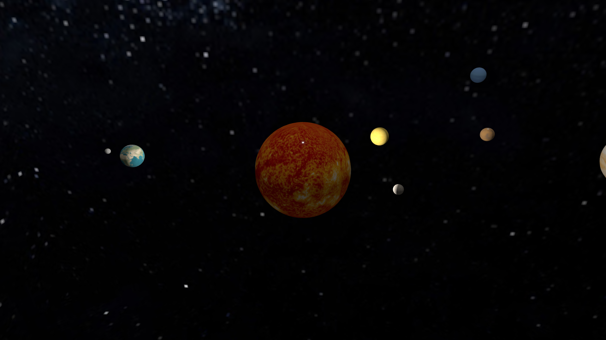

# 🌌 Solar System 3D

A 3D interactive Solar System simulation built with Three.js and Vite.

[](https://solar-system-3-d-bay.vercel.app)

## 🚀 Features

- Realistic 3D rendering of Sun and all 8 planets + Moon
- PBR textures for authentic planet surfaces
- Smooth orbital and rotational animations
- Interactive camera controls
- Saturn's rings using RingGeometry
- Space environment with CubeMap background

## 📸 Screenshots






## ⚙️ Installation

```bash
# Clone the repository
git clone https://github.com/surajbruh/solar-system-3d.git
cd solar-system-3d

# Install dependencies
npm install

# Start development server
npm run dev
```

The application will be available at `http://localhost:5173`

## 🎮 Controls

| Action | Description |
|--------|--------------|
| Left Click + Drag | Rotate camera |
| Scroll Wheel | Zoom in/out |
| Right Click + Drag | Pan camera |

## 🛠️ Build

```bash
# Create production build
npm run build

# Preview production build
npm run preview
```

## 🧑‍💻 Author

**Suraj Yadav**  
🌐[LinkedIn](https://www.linkedin.com/in/suraj-yadav-b15a1b36b)

📖[GitHub](https://github.com/surajbruh)

## 📄 License

MIT License
